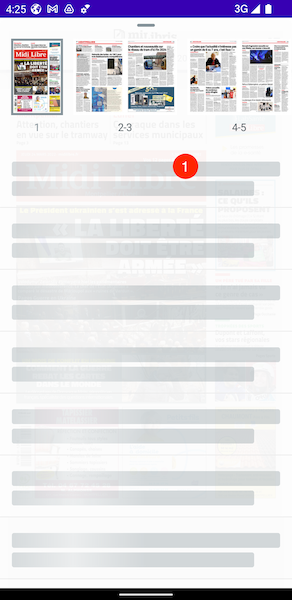
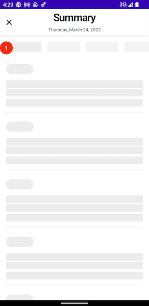
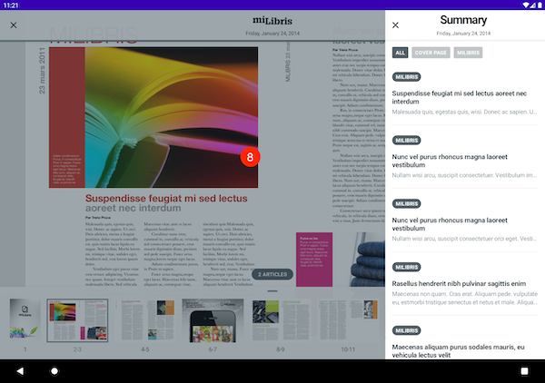

# Config reference

* [AlertConfig](#alertconfig)
* [ArticleReaderConfig](#articlereaderconfig)
* [ArticleSettingsConfig](#articlesettingsconfig)
* [NavigationBarConfig](#navigationbarconfig)
* [ReaderConfig](#readerconfig)
* [MiniSummaryConfig](#minisummaryconfig)
* [SlideshowBoxConfig](#slideshowboxconfig)
* [SummaryConfig](#summaryconfig)

## AlertConfig

The config for an instance of an alert.

| Badge | Name | Type | Default value | Description |
| ----- | ---- | ---- | ------------- | ----------- |
| 1 | or_popin_external_background | Color | #B2293236 70% | The color of the overlay background. |
| 2 | or_popin_background | Color | #FFFFFF | The background color of the content. |
| 3 | img_popin_default_illustration | Drawable | icon | The image displayed in the alert. |
| 4 | or_popin_title | Color | #1E323D | The text color of the title label. |
| 4 | ORH3 | Style | TextSize 22sp | The style of the title label. |
| 5 | or_popin_message | Color | #536067 | The text color of the message label. |
| 5 | ORBodyMax | Style | TextSize 18sp | The style of the message label. |
| 6 | OrButton | Style | All attributes | The style of the primary action button. |
| 7 | OrOutlinedButton | Style | All attributes | The style of the secondary action button. |

## ArticleReaderConfig

The config for an instance of the article reader.

| Badge | Name | Type | Default value | Description |
| ----- | ---- | ---- | ------------- | ----------- |
| 1 | navigationBar | [NavigationBarConfig](#navigationbarconfig) | | The config for the the article reader navigation bar. |
| 2 | cor_fish_eye_background | Drawable | icon | The background color of the fisheye label. |
| 2 | or_fish_eye_text_color | Color | #15202B | The text color of the fisheye label. |
| 2 | ORTiny | Style | TextSize 12 | The style for the fisheye label. |
| 3 | or_articles_bottom_button_background_light | Color | #FFFFFF | The light background color of the bottom bar. |
| 3 | or_articles_bottom_button_background_dark | Color | #1F1F1F | The dark background color of the bottom bar. |
| 4 | ic_or_bookmark | Drawable | icon | The icon of bookmark function color of the bottom bar. |
| 4 | or_articles_bottom_button_tint_default_light | Color | #1E323D | The default light tint of buttons in the bottom bar|
| 4 | or_articles_bottom_button_tint_default_dark | Color | #FFFFFF | The default dark tint of buttons in the bottom bar|
| 5 | ic_or_personalize | Drawable | icon | The icon of personalise function color of the bottom bar. |
| 6 | ic_or_listen | Drawable | icon | The icon of text to speech function color of the bottom bar. |
| 6 | ic_or_mute | Drawable | icon | The icon of text to speech mute function color of the bottom bar. |
| 7 | ic_or_share | Drawable | icon | The icon of share function color of the bottom bar. |

## ArticleSettingsConfig

The config for an instance of the article settings.

| Badge | Name | Type | Default value | Description |
| ----- | ---- | ---- | ------------- | ----------- |
| 1 | or_content_black_opacity_60 | Color | #9915202B 60% | The background color of the overlay when showing content over a screen. |
| 2 | or_articles_bottom_button_background_light | Color | #FFFFFF  | The light background color. |
| 2 | or_articles_bottom_button_background_dark | Color | #1F1F1F  | The dark background color. |
| 3 | or_articles_personalize_text_size_button_tint_light | ColorSelector | enabled: #86949B / disabled: #ECECEC | The light color of the font size buttons. |
| 3 | or_articles_personalize_text_size_button_tint_dark | ColorSelector | enabled: #606060 / disabled: #333333 | The dark color of the font size buttons. |
| 4 | or_articles_personalize_line_spacing_button_tint_light | ColorSelector | enabled: #1E323D / disabled: #ECECEC | The light color of the line spacing buttons. |
| 4 | or_articles_personalize_line_spacing_button_tint_dark | ColorSelector | enabled: #FFFFFF / disabled: #333333 | The dark color of the line spacing buttons. |
| 5 | or_display_mode_stroke_color | ColorSelector | enabled: #1D73A5 / disabled: #BEC2C5 | The border color of the user interface style buttons. |
| 6 | or_articles_bottom_button_tint_default | Color | light: #1E323D / dark: #FFFFFF | The color applied to images of the brightness control. |
| 6 | or_articles_personalize_brightness_seekbar_background | Color | light: #1E323D / dark: #FFFFFF | The color applied to the background progress of brightness control. |
| 6 | or_articles_personalize_brightness_thumb | Color | light: #86949B / dark: #606060 | The color applied to the thumb and progress color of brightness control. |
| 7 | or_articles_bottom_button_tint_selected_light | Color |  #1D73A5 | The light tint applied to personalise icon when setting is opened. |
| 7 | or_articles_bottom_button_tint_selected_dark | Color |  #1D73A5 | The dark tint applied to personalise icon when setting is opened. |brightness control. |
| 8 | or_articles_bottom_button_tint_disabled_light | Color |  #86949B | The light tint applied to the other buttons when setting is opened. |
| 8 | or_articles_bottom_button_tint_disabled_dark | Color |  #606060 | The dark tint applied to the other buttons when setting is opened. |

## NavigationBarConfig

The config for an instance of a navigation bar.

| Badge | Name | Type | Default value | Description |
| ----- | ---- | ---- | ------------- | ----------- |
| 1 | or_toolbar_background_color_light | Color | light: #F2FFFFFF | The light background color of the navigation bar. |
| 1 | or_toolbar_background_color_dark | Color |  #F21F1F1F | The dark background color of the navigation bar. |
| 2 | or_navigation_button_tint_light | Color |  #1E323D  | The light color applied to buttons. |
| 2 | or_navigation_button_tint_dark | Color |  #FFFFFF  | The dark color applied to buttons. |
| 3 | or_toolbar_title_text_light | Color |  #15202B | The light text color of the title. |
| 3 | or_toolbar_title_text_dark | Color |  #FFFFFF | The dark text color of the title. |
| 3 | ORH1 | Style | TextSize 28sp | The style of the title. |
| 4 | or_toolbar_subtitle_text_light | Color |  #15202B | The light text color of the subtitle. |
| 4 | or_toolbar_subtitle_text_dark | Color |  #FFFFFF | The dark text color of the subtitle. |
| 4 | ORTiny | Style | TextSize 12sp | The style of the subtitle. |
| 5 | or_progress_background_color | Color | light: #86949B / dark: #606060 | The background (non filled) color of the progress bar. |
| 6 | or_progress_color | Color | light: #86949B / dark: #B4B4B4 | The filled color of the progress bar. |
| 7 | or_logo_capsule_color_light | Color | #00FFFFFF | The light background color of the logo. |
| 7 | or_logo_capsule_color_dark | Color | #00FFFFFF | The dark background color of the logo. |

## ReaderConfig

The config for an instance of the reader.

| Badge | Name | Type | Default value | Description |
| ----- | ---- | ---- | ------------- | ----------- |
| 1 | or_page_view_holder_color | Color | light : #F9F9F9 / dark : #536067 | The holder color of the page when loading. |
| 2 | or_progress_color | Color | light : #86949B / dark : #B4B4B4 | The progress loading color when loading. |
| 3 | or_background_color | Color | light: #E5E5E5 / dark: #1F1F1F | The background color. |
| 4 | or_box_color | Color |#86949B 40% | The color used to highlight boxes on page turn. |
| 4 | debugBoxes | Boolean | true | Display boxes position with a transparent overlay. |
| 4 | enabledDoublePage | Boolean | true | If false, always display single pages, even in landscape. |
| 4 | shouldEnableLongPressOnArticles | Boolean | true | Enable the long press gesture to open articles. |
| 4 | isLandscapeOnly | Boolean | false | Always open reader in landscape |
| 5 | available_articles_indicator_start_bg_color | Color | light: #E5E5E5 / dark: #1F1F1F | The background color of the article capsule when the bottom sheet is in the "hidden" position. |
| 5 | available_articles_indicator_start_text_color | Color | light: #536067 / dark: #B4B4B4 | The text color of the article capsule when the bottom sheet is in the "hidden" position. |
| 5 | available_articles_indicator_start_bg_color | Color | light: #F1F1F1 / dark: #1F1F1F | The background color of the "no articles" view. |
| 5 | available_articles_indicator_start_text_color | Color | light: #536067 / dark: #B4B4B4 | The text color of the "no articles" view. |
| 5 | ORMark | Style | TextSize 12sp bold | The style of the article capsule in the "articles" and "no articles state. |
| 6 | available_articles_indicator_end_bg_color | Color | light: #536067 / dark: #B4B4B4 | The background color of the article capsule when the bottom sheet is in the "bottom" position. |
| 6 | available_articles_indicator_end_text_color | Color | light: #F1F1F1 / dark: #F1F1F1 | The text color of the article capsule when the bottom sheet is in the "bottom" position. |
| 7 | or_flat_plan_line_color | Color | light: #86949B / dark: #BEC2C5 | The color of the bottom sheet drag indicator view. |
| 8 | or_flat_plan_holder_color | Color | light: #5986949B / dark: #5986949B | The background color of flatplan images while they are loading. |
| 8 | or_flat_plan_selected_color | Color | light: #536067 / dark: #B4B4B4 | The color of the border in the flatplan when selected. |
| 8 | or_flat_plan_selected_color | Color | light: #536067 / dark: #B4B4B4 | The color of the text in the flatplan when selected. |
| 8 | or_flat_plan_text_color | Color | light: #536067 / dark: #FFFFFF | The color of the text in the flatplan when not selected. |

## MiniSummaryConfig
The config for the mini summary bottom sheet of the reader.

| 1 | or_mini_summary_loading_tint | Color | light: #BEC2C5 / dark: #536067 | The color of the label placeholders in the mini-summary while loading. |
| 2 | OneReaderFlatPlanArticleTitleTextView | Style | light: #15202B / dark: #FFFFFF | The color of the cell title in the mini-summary. |
| 3 | isFaceCropEnabled | Boolean | false | Enable on-device smart crop for images. |
| 3 | or_flat_plan_background_color | Color | light: #F9F9F9 35% / dark: #1F1F1F 35% | The background color of the bottom sheet. |
| 4 | or_mini_summary_separator_light | Color | #ECECEC | The light separator color in the mini-summary. |
| 4 | or_mini_summary_separator_dark | Color | #333333 | The dark separator color in the mini-summary. |

## SlideshowBoxConfig

The config for an instance of an slideshow box.

| Badge | Name | Type | Default value | Description |
| ----- | ---- | ---- | ------------- | ----------- |
| 1 | or_background_color | Color | light: #E5E5E5 / dark: #121212 | The background color. |
| 2 | or_image_caption_bg_color | Color | light: #6F1E323D / dark: #6F1E323D | The background  color of the caption. |
| 2 | or_image_caption_text_color | #FFFFFF | The text color of the caption. |
| 3 | or_indicator_active_color | Color |  #15202B | The color of the selected page indicator. |
| 3 | or_indicator_inactive_color | Color |  #86949B | The color of the page indicator. |

## SummaryConfig

The config for an instance of the summary.

| Badge | Name | Type | Default value | Description |
| ----- | ---- | ---- | ------------- | ----------- |
| 1 | or_loading_color_light | Color |  #ECECEC | The light color of the label placeholders while loading. |
| 1 | or_loading_color_dark | Color |  #333333 | The dark color of the label placeholders while loading. |
| 2 | or_rubric_selected_background_light | Color | #536067  | The light background color of rubric views. |
| 2 | or_rubric_selected_background_dark | Color | #606060 | The dark background color of rubric views. |
| 2 | or_rubric_tint_light | Color | #FFFFFF | The light text color of rubric views. |
| 2 | or_rubric_tint_dark | Color | #FFFFFF | The dark text color of rubric views. |
| 2 | OneReaderRubricTextView | Style | TextSize 12sp bold | The style of rubric views. |
| 3 | or_holder_color | Color | light: #F9F9F9 / dark: #536067 | The background color of image views when loading. |
| 3 | isFaceCropEnabled | Boolean | false | Enable on-device smart crop for images. |
| 4 | or_summary_article_title_tint_light | Color |  #1E323D  | The light color of the title in article cells. |
| 4 | or_summary_article_title_tint_dark | Color |  #FFFFFF | The dark color of the title in article cells. |
| 4 | OneReaderSummaryArticleTitleTextView | Style | TextSize 16sp bold | The style of the title in article cells. |
| 5 | or_summary_article_subtitle_tint_light | Color |  #86949B | The light color of the subtitle in article cells. |
| 5 | or_summary_article_subtitle_tint_dark | Color | #BEC2C5 | The dark color of the subtitle in article cells. |
| 5 | OneReaderSummaryArticleSubtitleTextView | Style | TextSize 14sp | The style of the subtitle in article cells. |
| 6 | or_summary_article_reading_time_tint_light | Color |  #536067 | The light color of reading time icon and text. |
| 6 | or_summary_article_reading_time_tint_light | Color |   #ECECEC | The dark color of reading time icon and text. |
| 6 | fonts.cellFooter | FontInfo | System 12 | The font of footer text in article cells. |
| 6 | images.readingTime | UIImage? | fi_watch | The image for reading time indicator in cells. |
| 7 | or_bookmark_tint_light | Color |  #536067 | The light tint for bookmark button in cells. |
| 7 | or_bookmark_tint_dark | Color | #ECECEC | The dark tint for bookmark button in cells.  |
| 7 | ic_or_bookmark_empty | Drawable | drawable-res | The image for bookmark button in cells (OFF). |
| 7 | ic_or_bookmark_filled | UIImage? | drawable-res | The image for bookmark button in cells (ON). |
| 8 | or_transparent_bg | Color | light: #6F1E323D / dark: #6F1E323D | The background color of the overlay when showing content over a screen. |
